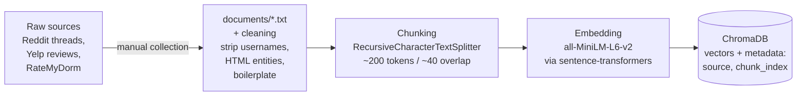
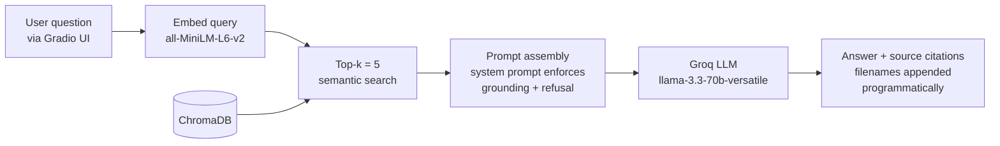

# Project 1 Planning: The Unofficial Guide

> Write this document before you write any pipeline code.
> Your spec and architecture diagram are what you'll use to direct AI tools (Claude, Copilot, etc.) to generate your implementation — the more specific they are, the more useful the generated code will be.
> Update the Retrieval Approach and Chunking Strategy sections if you change your approach during implementation.
> Update this file before starting any stretch features.

---

## Domain

This project focuses on off-campus housing advice for the USC and other Downtown LA campuses. It's aimed at out-of-area and international students who often can't find practical information from official channels. Things like neighborhood safety, typical commutes, local amenities, and the day-to-day realities of living nearby. I'll collect firsthand perspectives from forums, subreddits, local groups, and student reports to build a useful guide.

---

## Documents

<!-- List your specific sources: URLs, subreddit names, forum threads, or file descriptions.
     Aim for at least 10 sources that together cover different subtopics or perspectives within your domain. -->

| # | Source | Description | URL or location |
|---|--------|-------------|-----------------|
| 1 | r/USC wiki (Off-campus housing) | Wiki and FAQs about off-campus housing options near USC | https://www.reddit.com/r/USC/wiki/offcampushousing/ |
| 2 | r/USC thread: "Does anyone live in an off campus housing that they actually like" | Student experiences and recommendations | https://www.reddit.com/r/USC/comments/1pnrslg/does_anyone_live_in_an_off_campus_housing_that/ |
| 3 | r/USC thread: "Off Campus Housing" | Discussion thread about available listings and tips | https://www.reddit.com/r/USC/comments/1tukar5/off_campus_housing/ |
| 4 | r/USC thread: "Best off-campus housing options for International/Transfer students!" | Needs of international and transfer students | https://www.reddit.com/r/USC/comments/1tpprrr/best_offcampus_housing_options_for/ |
| 5 | r/USC thread: "best off campus housing options" | Ppopular student housing choices | https://www.reddit.com/r/USC/comments/1pdhe0p/best_off_campus_housing_options/ |
| 6 | r/USC thread: "OFF CAMPUS HOUSING" | General housing advice and occasional listing sharings | https://www.reddit.com/r/USC/comments/1sz911f/off_campus_housing/ |
| 7 | RateMyDorm — McCarthy Honors reviews | Specific reviews for McCarthy Honors Residential College | https://www.ratemydorm.com/reviews/university-of-southern-california/university-of-southern-california-mccarthy-honors-residential-college |
| 8 | Yelp — The Residences at Lorenzo | User reviews and ratings for a private student residence | https://www.yelp.com/biz/the-residences-at-lorenzo-los-angeles |
| 9 | Yelp — University Gateway | User reviews for a nearby student apartment complex | https://www.yelp.com/biz/university-gateway-los-angeles-2 |
| 10 | r/AskLosAngeles thread: "Honestly, what is the area around USC like for a single female?" | Local residents' perspectives on safety and gender-specific concerns | https://www.reddit.com/r/AskLosAngeles/comments/1s205xq/honestly_what_is_the_area_around_usc_like_for_a/ |

---

## Chunking Strategy

<!-- How will you split documents into chunks?
     State your chunk size (in tokens or characters), overlap size, and explain why those
     numbers fit the structure of your documents.
     A review-heavy corpus warrants different chunking than a long FAQ. -->

I'll be using a recursive character text splitter, which tries to break the text down by paragraphs first, then sentences, and finally words.

**Chunk size:** ~200 tokens
This should be the sweet spot to capture a full Reddit comment or a detailed paragraph from a Yelp review without diluting the context.

**Overlap:** ~40 tokens
If a student's review spills over a hard paragraph break, the overlap ensures the connection between their thoughts isn't lost in the split.

**Reasoning:**
Because my corpus relies heavily on Reddit threads and Yelp reviews, the information is highly conversational and opinionated. Review-style text naturally occurs in short bursts, so we want smaller chunks than we would use for a massive, continuous textbook.

---

## Retrieval Approach

<!-- Which embedding model are you using (e.g., all-MiniLM-L6-v2 via sentence-transformers)?
     How many chunks will you retrieve per query (top-k)?
     If you were deploying this for real users and cost wasn't a constraint, what tradeoffs
     would you weigh in choosing a different embedding model — context length, multilingual
     support, accuracy on domain-specific text, latency? -->

**Embedding model:** all-MiniLM-L6-v2
I will use `all-MiniLM-L6-v2` via `sentence-transformers` because it runs locally, and doesn't require an API key or an internet connection to generate embeddings for the chunks.

**Top-k:** 5
My chunk size is 200 tokens each. Retrieving 5 chunks provides the LLM with about 1,000 tokens of relevant context, which should be enough to generate a good answer without adding too much off-topic noise to the prompt.

**Production tradeoff reflection:** 
- Domain-specific accuracy: `all-MiniLM-L6-v2` is a general-purpose embedding model. User reviews may contain internet slang, Reddit abbreviations, and Gen Z expressions, so a model fine-tuned on conversational or review-based text could potentially deliver better retrieval performance.
- Context length: If I needed to embed very large documents (such as entire PDF lease agreements) without splitting them into many small chunks, I would likely need a model that supports a larger context window than most local embedding models can handle.
- Context Length: If I wanted to embed massive documents (like entire PDF lease agreements) without splitting them so aggressively, I would need a model support larger context window than what local models typically can offer
- Latency and scalability: Local models are free to run and provide low-latency inference, but as the system scales, maintaining the infrastructure and serving embeddings efficiently could become an operational challenge.

---

## Evaluation Plan

<!-- List your 5 test questions with their expected correct answers.
     Questions should be specific enough that you can judge whether the system's response
     is right or wrong. "What are good dining halls?" is too vague.
     "What do students say about wait times at [dining hall name] during lunch?" is testable. -->

| # | Question | Expected answer |
|---|----------|-----------------|
| 1 | How are the reliability and wait times of the shuttles at The Residences at Lorenzo? | The shuttles are rarely on time and are often crowded to maximum capacity. |
| 2 | Which specific streets or patrol boundaries are considered the safest for walking around the USC campus at night? | 30th St, 29th St, Ellendale Place, Orchard Ave, and USC Village. |
| 3 | When comparing Tuscany and Icon, which apartment complex is more expensive? | Icon Plaza is generally more expensive because it offers true private single-bedroom units. |
| 4 | Which off-campus housing companies or apartment buildings offer furnished rooms or lenient guarantor requirements for international students? | International students frequently choose housing companies such as Tripalink, Stuho, and Orion Housing, as well as large apartment complexes like The Lorenzo and University Gateway. |
| 5 | What are the most common daily annoyances regarding the elevators and street noise at University Gateway? | Tenants frequently complain that the eight available elevators take too long to arrive during peak morning hours and other busy times. Units facing the main roads also experience high levels of city and traffic noise. |

---

## Anticipated Challenges

<!-- What could go wrong? Name at least two specific risks with reasoning.
     Consider: noisy or inconsistent documents, missing source attribution, off-topic
     retrieval, chunks that split key information across boundaries. -->

1. Lost Pronoun Context Across Chunks
Because I am using a relatively small chunk size (~200 tokens) to capture individual reviews, there is a risk that a user might name the apartment complex in paragraph one, but refer to it as "it" or "this building" in paragraph two. If the chunk splits between these paragraphs, the LLM will receive a chunk complaining about "the terrible elevators" but won't know which building the review is actually about.

2. Noisy Data and Slang
Reddit threads and Yelp reviews are messy. They contain heavy slang, abbreviations (like "DPS" for Department of Public Safety), typos, and emotional rants. This noise could confuse the embedding model (`all-MiniLM-L6-v2`) or cause semantic search to miss relevant chunks because the student's query uses formal language while the source documents use casual slang.

---

## Architecture

**Tech stack:** `sentence-transformers` (`all-MiniLM-L6-v2`) for embeddings, ChromaDB as the local vector store, and Groq (`llama-3.3-70b-versatile`) as the LLM. Gradio for the query interface.

**Indexing pipeline** (runs once, offline — rebuilds whenever `documents/` changes):

**Query pipeline** (runs per user question):

The grounding contract lives in the system prompt at the Prompt assembly step: the LLM answers only from retrieved chunks and replies "I don't have enough information on that" when context is insufficient. Source filenames are attached from chunk metadata after generation, so attribution doesn't depend on the model remembering to cite.

---

## AI Tool Plan

<!-- For each part of the pipeline below, describe:
     - Which AI tool you plan to use (Claude, Copilot, ChatGPT, etc.)
     - What you'll give it as input (which sections of this planning.md, which requirements)
     - What you expect it to produce
     - How you'll verify the output matches your spec

     "I'll use AI to help me code" is not a plan.
     "I'll give Claude my Chunking Strategy section and ask it to implement chunk_text()
     with my specified chunk size and overlap" is a plan. -->

  
**Milestone 3 — Ingestion and chunking:**

**Milestone 4 — Embedding and retrieval:**

**Milestone 5 — Generation and interface:**
